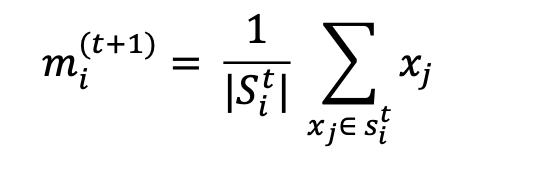

K-Means:

1. In the experiment, I first took the clusters and parsed the data to create a numpy array of it.
2. To execute the k means, I used the clusters from {2, 3, 4, 5, 6, 7, 8, 9, 10} and ran the
algorithm 10 times for each k value.
3. Then randomly selected centroids to form clusters according to the value of k and repeated
below steps until the algorithm has converged, o Assignment step:
4. First, took the Euclidean distance of each point and each centroid.
        
5. If the distance between any point and the centroid is lowest among all the centroids, then added it to that cluster.
o Update step:
6. Updated the centroid value using,
        
7. The algorithm is converged when no assignments change which means that the centroid values do not update.

Fuzzy-CMeans:
1. In the experiment, I first parsed the data to create a numpy array.
2. Then assigned random probabilities i.e. membership grades to each data point in the data
set.
3. Repeated below steps until the algorithm converged, 
   1. Computed the centroid for each cluster. 
   2. For each data point computed the membership grades.
4. The algorithm is converged when no assignments change which means that the centroid
   values do not update.